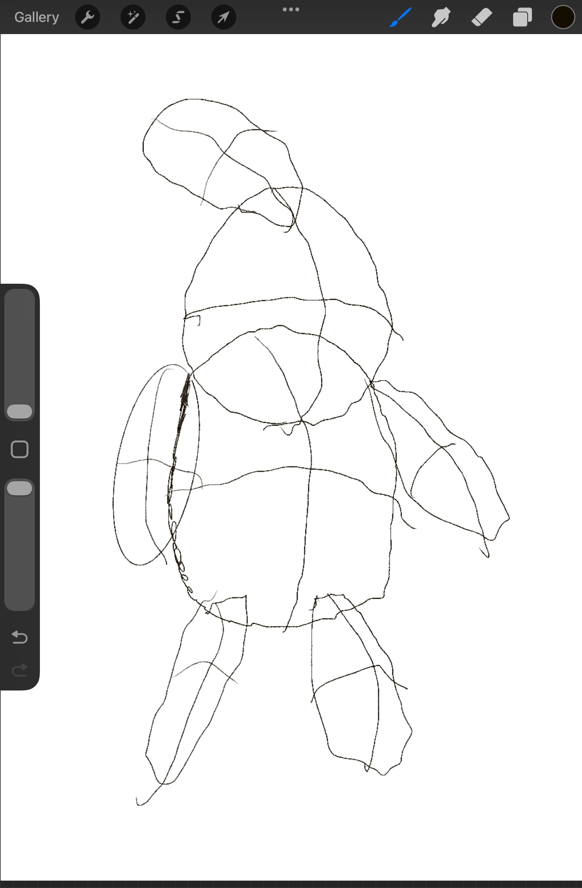
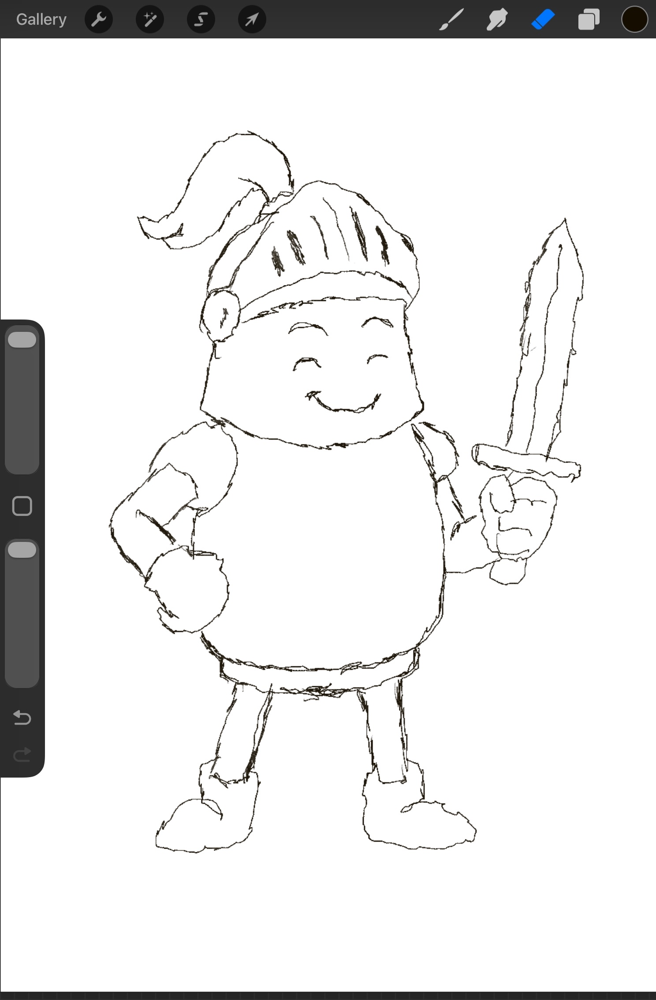
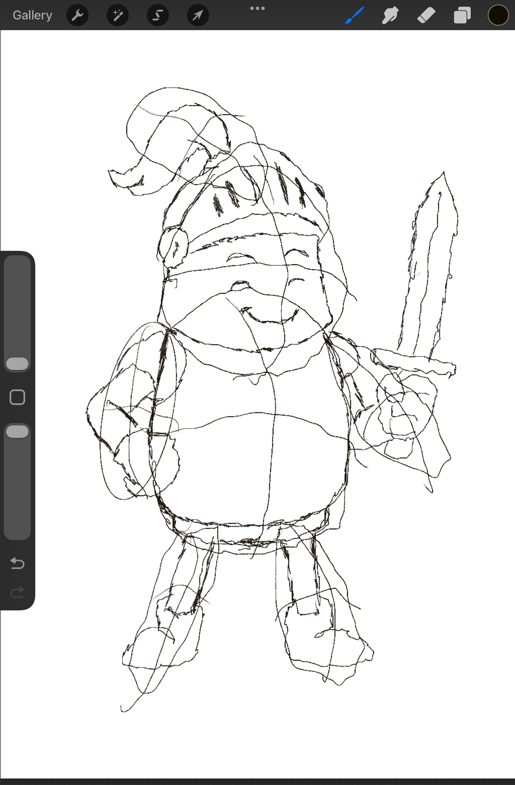
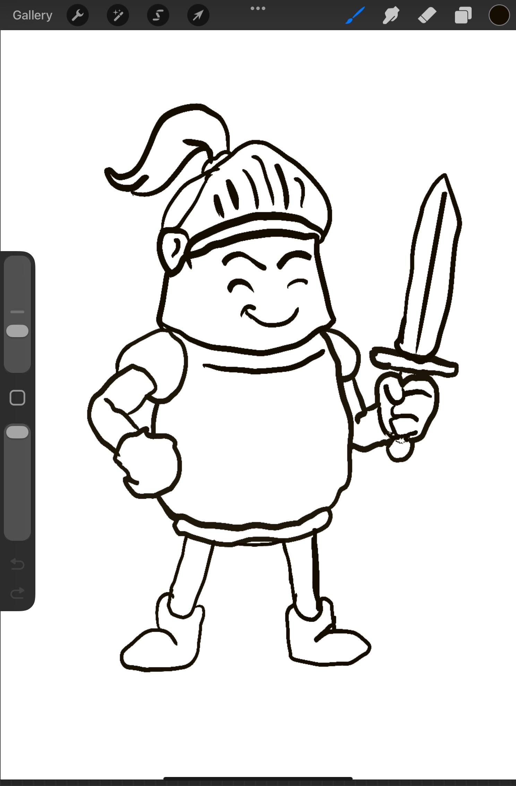
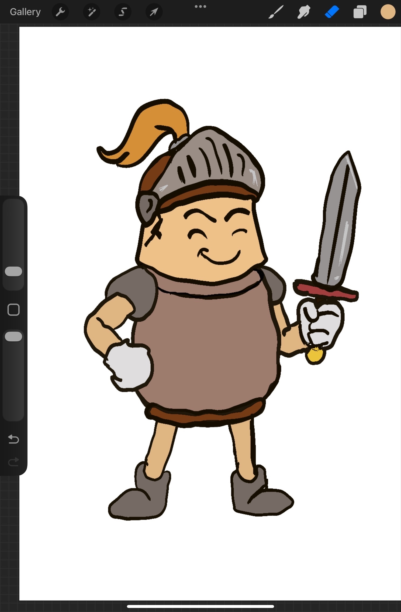
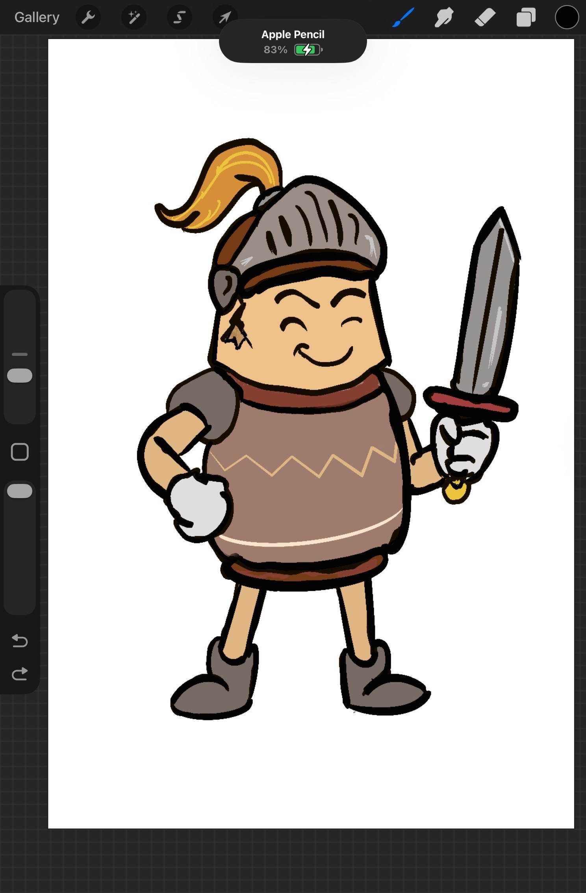

# Jarlang — README

<p align="center">
  
</p>
---

## How to Guide: Getting Started with Jarlang


### 1. Running Jarlang

#### Option 1: Using the JAR file

- Download or build `jarlang.jar` (found in the `JarlangRunner` directory).
- Start the Jarlang shell (REPL):
  ```sh
  java -jar JarlangRunner/jarlang.jar
  ```
- Inside the shell, run a `.vase` file with:
  ```
  !run yourfile.vase
  ```

#### Option 2: Run via python/docker script in root (Need implementation)

- Add executable permissions to run_jarlang.py (remember to always look deeply at scripts before giving permissions or running)

-TODO: MODE TO BE ADDED HERE WHEN DOCKER is working

### 2. Language Concepts Tutorial

#### Variables
- Declare with `wield`:
  ```vase
  wield x 10
  wield name "JarKnight"
  ```

#### Types: Ints, Doubles, Strings
- Numbers can be integers or floats:
  ```vase
  wield a 42      # int
  wield b 3.14    # double
  wield s "hello" # string
  ```

#### Conditionals
- Use `judge` and `orjudge` for if/elif/else:
  ```vase
  wield n 5
  judge n > 0 mend chant "positive"
  orjudge n == 0 mend chant "zero"
  orjudge mend chant "negative"
  ```

#### Functions & Function Defining
- Define with `forge`, return with `mend`:
  ```vase
  forge add(a, b)
    mend a + b
  chant add(2, 3)  # prints 5
  ```

#### Loops
- While loop: `lest`
  ```vase
  wield i 0
  lest i < 3 {
    chant i
    i = i + 1
  }
  ```
- For loop: `endure`
  ```vase
  endure wield j 0; j < 3; j = j + 1 {
    chant j
  }
  ```

#### Strings & Operations
- Concatenate with `+`:
  ```vase
  wield greeting "Hello, " + name
  chant greeting
  ```

#### Importing & Using the Standard Library
- Import helpers:
  ```vase
  summon "stdlib.vase"
  chant commune(3, 4)  # prints 7.0
  ```

---

## What is Jarlang?

Jarlang is a small, warrior-themed expression language and learning interpreter implemented in Java. It’s designed for clarity and experimentation — the syntax uses themed keywords (forge/wield/chant/summon/judge/lest/mend) while providing familiar arithmetic, control flow, functions, and a small standard library.

This README documents the language syntax, runtime semantics, developer extension points, and the current standard library provided in `stdlib.vase`.

---

## Quick start
- Start the REPL (if provided by your runner), or call `!run filename.vase` inside the REPL.
- Standard library functions are located in `stdlib.vase` and are imported with `summon "stdlib.vase"`.

---

## Lexical elements

- Comments: single-line comments start with `#` and run to the end of line.
- Identifiers: letters, digits and `_`, must start with a letter.
- Strings: double-quoted characters, e.g. `"Hello"`.
- Numbers: integers (`42`) and floats (`3.14`).
- Tokens include operators and punctuation:
  - Arithmetic: `+` (commune), `-` (banish), `*` (rally), `/` (slash), `^` (ascend)
  - Comparison: `==`, `!=`, `<`, `>`, `<=`, `>=`
  - Assignment: `=` (bind)
  - Grouping: `(` `)` and `{` `}`
  - Delimiters: `,` `:` `;`

---

## Keywords (themed)

- `wield` — declare a variable (e.g., `wield x 10`)
- `forge` — begin a function definition (e.g., `forge add(a, b) ...`)
- `mend` — return from a function or end a single-line `judge` branch
- `chant` — print / output expression (like `print`)
- `summon` — import another `.vase` file into the current context
- `judge` — if / conditional branch
- `orjudge` — else-if / chained conditional branch
- `lest` — while loop (like `while`)
- `gather`/`disperse` — parentheses (internal naming; symbol tokens are `(` and `)`)

Note: Keywords are mapped to token types internally; your code uses the literal words above.

---

## Expressions and operators

- Arithmetic expressions obey standard precedence:
  - Parentheses `( ... )`
  - Exponentiation `^`
  - Multiplication/Division `*` `/`
  - Addition/Subtraction `+` `-`
- Unary operators: `-x` and `+x` and logical `!x` (if implemented).
- Example:

```vase
chant (3 + 4) * 2   # prints 14
```

- `+` in expressions will perform numeric addition for numbers, and string concatenation if either operand is a string (the interpreter coerces or prefers string concatenation for string operands).

---

## Statements

- Variable declaration:
  - `wield <name> <expression>`
  - Example: `wield x 10`
- Assignment:
  - `<name> = <expression>`
  - Example: `x = x + 1`
- Print:
  - `chant <expression>`
  - Example: `chant "Hello"`, `chant x + 1`
- Blocks:
  - Use `{ ... }` for grouped statements (parser supports block nodes).
- Semicolons are optional separators at top-level; the parser is flexible about separators between statements.

---

## Control flow

- If / elif / else (themed):
  - `judge <condition> mend <expr-or-block> [orjudge <condition> mend <expr-or-block>]...`
  - Example:

```vase
judge x > 0 mend
    chant "positive"
orjudge x == 0 mend
    chant "zero"
orjudge mend
    chant "negative"
```

- While loop:
  - `lest <condition> { <statements> }`
  - Example:

```vase
wield i 0
lest i < 5 {
    chant i
    i = i + 1
}
```

---

## Functions

- Define:

```vase
forge add(a, b)
    mend a + b
```

- Return:
  - Use `mend <expression>` inside a function to return immediately with a value.
  - If no explicit `mend` is used in a function-body block, the last evaluated expression is treated as the result.
- Call:

```vase
chant add(2, 3)
```

- Functions capture the current context as closure when defined (see `JarlangFunction`).

---

## Imports

- `summon "<filename>.vase"` executes another file and injects its top-level definitions into the current context.
- The runner provides `runFileIntoContext` to avoid re-importing the same file multiple times.

---

## Runtime values & types

- The runtime currently operates with these value kinds:
  - Numbers (Double)
  - Strings
  - Objects (for builtin types like `JarlangArray`, or `JarlangFunction`)
- The interpreter uses a `Result` class to represent evaluation results (NUMBER / STRING / OBJECT). Builtins and context storage prefer raw Java types (Double, String, JarlangArray) for compatibility.

---

## Standard library (high level)

The project ships with `stdlib.vase`. Key helpers include:

- Numeric utilities:
  - `commune(a,b)`, `banish(a,b)`, `rally(a,b)`, `slash(a,b)`, `ascend(a,b)` — arithmetic wrappers
  - `max(a,b)`, `min(a,b)`, `clamp(x,lo,hi)`
  - `abs(x)`, `sign(x)`, `sqrt(x)`, `pow_int(a,n)`, `fact(n)`, `fib(n)`
  - `gcd(a,b)`, `lcm(a,b)`, `map_range(...)`, `hypot(a,b)`, `deg2rad`, `rad2deg`
  - `is_even`, `is_odd`, `is_prime`

- Utilities:
  - `add1(x)` — convenience
  - `sumTo(n)`, `mean2(a,b)`, `approx_equal(a,b,eps)`

- Small collection of string helpers have been added to `stdlib.vase` (pure-vase):
  - `concat(a,b)` — concatenation wrapper
  - `tale_repeat(s,n)` — repeat string `s` `n` times
  - `barren_tale(s)` — string emptiness test

(See `stdlib.vase` for the full list and implementations.)

---

## Builtins & extending the runtime

- Builtins are Java functions stored in the `Context` — see `lib/JarlangCollections.java` for an example `BuiltinFunction` interface and array helpers.
- To add a builtin:
  1. Implement a `BuiltinFunction` object (a lambda or an implementation of the interface).
  2. Register it in the global context with `ctx.setVariable("<name>", builtinFunction)`.
  3. The `FunctionCallNode` recognizes and invokes `BuiltinFunction` instances.
- Builtins should accept raw Java values (Double, String, objects) and return raw Java values. The interpreter converts between `Result` and raw objects at call boundaries.

---

## Errors & diagnostics

- Error types:
  - `IllegalCharError` — lexical errors (bad characters, unterminated string)
  - `SyntaxError` — parser errors (unexpected token, missing `)`, etc.)
  - `InterpreterError` — runtime errors (division by zero, undefined variable, type mismatch)
- Position tracking:
  - The lexer attaches `Position` objects to tokens (idx, line, column).
  - Errors include position and — when available — filename for helpful messages.
- Example error message:

```
SyntaxError: Expected ')' in main.vase at line 3, column 14 (idx: 14)
```

---

## REPL & testing

- You can run single-file tests with the included runner:
  - `./run.sh tests/my_test.vase`
- Tests are regular `.vase` scripts that `chant` outputs for manual verification.
- Example test pattern:

```vase
summon "stdlib.vase"
chant "== TEST =="
chant commune(7,7)
```

- Recommended practice: keep small focused tests under `tests/` that exercise individual stdlib functions and control flow.

---

## Debugging tips

- Use `chant` liberally to inspect values while developing.
- Add temporary debugging prints inside Java code (e.g., in `VariableNode.evaluate`) to inspect context contents.
- Common issues:
  - Mixing `Result` objects with raw Java values when storing to Context — ensure arguments are unwrapped before storing.
  - Forgetting to register builtins in the global context.
  - Indexing, bounds, and type mismatches from partial refactors.

---

## Development notes & extension points

---

## Recent Additions

- **Test Suite Library:**
  - Added `testlib.vase`, a pure-vase test helper library with assertion functions (`assert_eq`, `assert_true`, etc.), pass/fail counters, and summary reporting. This makes it easy to write automated tests for language features and standard library functions.
- **Vow/Sacred Types:**
  - The language now supports `vow` and `sacred` variable declarations, enforcing immutability and special semantics for constants and protected variables. Reassignment to these types is prevented at runtime.
- **Endure Loops:**
  - Added the `endure` keyword for for-loop style iteration, supporting initializer, condition, increment, and loop body. This complements the existing `lest` (while) loop and enables more expressive control flow.

- Code lives under `lib/`:
  - `jarlang.java` — lexer, parser, AST nodes, interpreter core.
  - `JarlangCollections.java` — example builtins and helper types (arrays).
  - `JarlangFileRunner.java`, `JarlangShell.java` — runner/REPL utilities.
- Adding syntax (array literal, indexing) requires coordinated changes to:
  - Lexer (new tokens), Parser (factor/primary handling), AST (ArrayNode, AccessNode), and Interpreter (Result/Object handling).
  - Prefer small incremental changes and frequent compile/test cycles.

---

## Contribution & coding style

- Use the project’s naming flavor — warrior/medieval words — for user-facing keywords and builtins (e.g., `summon`, `forge`, `chant`, `cohort_*`).
- Keep `Context` storage as plain Java values (Double/String/Object); avoid storing `Result` except transiently.
- Write small unit tests in `tests/` for each change. Aim for a tight edit–compile–test loop.

---

## Examples

Function definition and call:

```vase
forge greet(name)
    mend "Hello, " + name

chant greet("Adam")  # Hello, Adam
```

Conditional and loops:

```vase
wield n 5
judge n <= 1 mend
    chant "trivial"
orjudge mend
    wield i 0
    lest i < n {
        chant i
        i = i + 1
    }
```

Import and use stdlib:

```vase
summon "stdlib.vase"
chant commune(3, 4)  # 7.0
```

---

## Mascot Progress: The Making of JarKnight

The JarKnight mascot was created to represent the spirit of Jarlang: playful, bold, and ready for battle! Below is the visual journey from sketch to final mascot, showing each stage of the design process:

<div align="center">
  
  
  
  
  
  
  
  
</div>

Each image above shows a step in the mascot's evolution, from initial concept to the polished JarKnight you see at the top of this README!

---
Copyright © Adam Lenarduzzi 2025 — Jarlang
